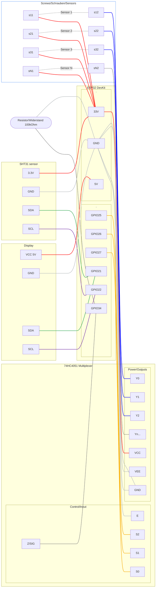

# Whats this ??

A selfmade hygrometer with ESP32 which measures the humidity in our walls in the house. 

I use it, to measure the humidity in walls in our house. In a few days, we will put a creme into the walls, 
to get them dry again, and I want to see progress to know, if it was worth buying and doing it.

Also, to get an idea, if the weather has any influence on the humidity of our walls.

I use 2 RJ45 CAT7 Network cables to connect to the screws in the wall.

## What it does

- connects via Wifi 
- serves its values via prometheus endpoint on /metrics
- sends its values via MQTT to configurable endpoint
- uses a SHT31 Sensor (if available)
- prints out °C and % humidity + all 8 sensors/screws on a LCD Display (currently on 5V)
- has a website to configure it 

Read [MEASUREMENTS.md](MEASUREMENTS.md) (currently only in german, if interested, use a translator or tell me)

## Todos:

- accesspoint mode as long as no Wifi is configured
- reset button in webinterface
- smaller display
- buy 3d printer and give it a nice case :(
- put photos of setup (once its nice enough)

## Wiring Diagram: ESP32 DevKit V1 & 74HC4051

### 1. Power Supply

- V5 / VIN (on ESP32): Not required if USB-C is connected.
- 3V3 (ESP32) → VCC (Mux Pin 16)
- GND (ESP32) → GND (Mux Pin 8) AND VEE (Mux Pin 7)
- GND (ESP32) → EN (Mux Pin 6 / Enable) — Must be connected to GND for the Mux to operate.

### 2. Address Control (Which channel is being measured?)

- GPIO 25 (ESP32) → S0 / A (Mux Pin 11)
- GPIO 26 (ESP32) → S1 / B (Mux Pin 10)
- GPIO 27 (ESP32) → S2 / C (Mux Pin 9)

### 3. Measurement Path (Analog)

Here, the wall resistance is translated into voltage:

- Z / SIG (Mux Pin 3) → GPIO 34 (ESP32)
- 100kΩ Resistor: One leg to GPIO 34, the other to GND.

### 4. Wall Sensors (Screws)

- Screw A (at each measurement point): All are connected directly to 3V3 on the ESP32.
- Screw B (Measurement Point 1) → Y0 (Mux Pin 13)
- Screw B (Measurement Point 2) → Y1 (Mux Pin 14)
- ... (Y2=Pin 15, Y3=Pin 12, Y4=Pin 1, Y5=Pin 5, Y6=Pin 2, Y7=Pin 4)

### 5. Schematic Representation Attempt

grey: GND

red: Power (3,3V or 5V)

orange: channel control

blue: backchannel measurement 

green/violet: I2C controls

## List of materials:

- ESP32 [amazon.de/dp/B0DGG7LXMF?psc=1&ref=ppx_pop_dt_b_product_details](amazon.de/dp/B0DGG7LXMF?psc=1&ref=ppx_pop_dt_b_product_details)
- Multiplexer [https://www.amazon.de/dp/B09Z29W8XV](https://www.amazon.de/dp/B09Z29W8XV)
- SHT31 [https://www.amazon.de/dp/B01GQFUY0I](https://www.amazon.de/dp/B01GQFUY0I)
- Display [https://www.amazon.de/dp/B07CQG6CMT?s=bazaar](https://www.amazon.de/dp/B07CQG6CMT?s=bazaar)
- RJ45 Breakout Board [https://www.amazon.de/dp/B0CML41H78](https://www.amazon.de/dp/B0CML41H78)
- 16 V2A Edelstahlschrauben Schlüsselschrauben M6x60 + M6 Unterlegscheiben von toom 
- CAT7 Netzwerkkabel 10m (cut in two for 8 Messpunkte)
