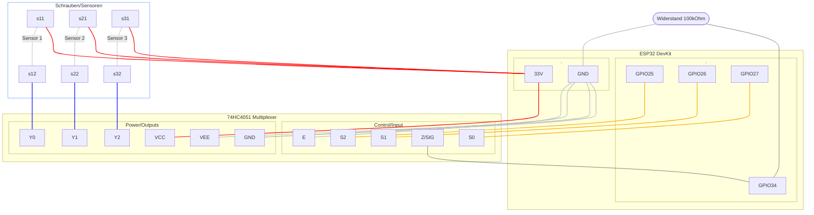

# Schaltplan: ESP32 DevKit V1 & 74HC4051

## 1. Stromversorgung (Power)

- V5 / VIN (am ESP32): Nicht benötigt, wenn USB-C angeschlossen ist.
- 3V3 (ESP32) → VCC (Mux Pin 16)
- GND (ESP32) → GND (Mux Pin 8) UND VEE (Mux Pin 7)
- GND (ESP32) → EN (Mux Pin 6 / Enable) — Muss auf GND liegen, damit der Mux arbeitet.

## 2. Adress-Steuerung (Welcher Kanal wird gemessen?)

- GPIO 25 (ESP32) → S0 / A (Mux Pin 11)
- GPIO 26 (ESP32) → S1 / B (Mux Pin 10)
- GPIO 27 (ESP32) → S2 / C (Mux Pin 9)

## 3. Mess-Pfad (Analog)

Hier wird der Widerstand der Wand in Spannung übersetzt:

- Z / SIG (Mux Pin 3) → GPIO 34 (ESP32)
- 100kΩ Widerstand: Ein Bein an GPIO 34, das andere Bein an GND.

## 4. Die Wand-Sensoren (Schrauben)

- Schraube A (an jeder Messstelle): Alle werden direkt mit 3V3 am ESP32 verbunden.
- Schraube B (Messstelle 1) → Y0 (Mux Pin 13)
- Schraube B (Messstelle 2) → Y1 (Mux Pin 14)
- ... (Y2=Pin 15, Y3=Pin 12, Y4=Pin 1, Y5=Pin 5, Y6=Pin 2, Y7=Pin 4)

## 5. Versuch einer schematischen Darstellung

